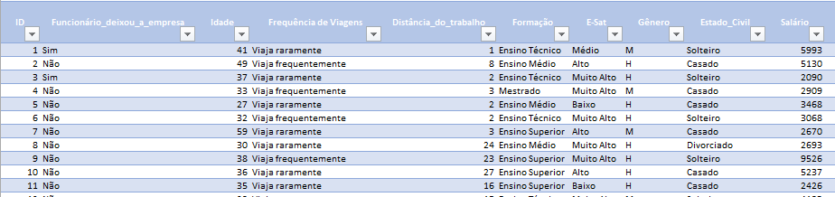
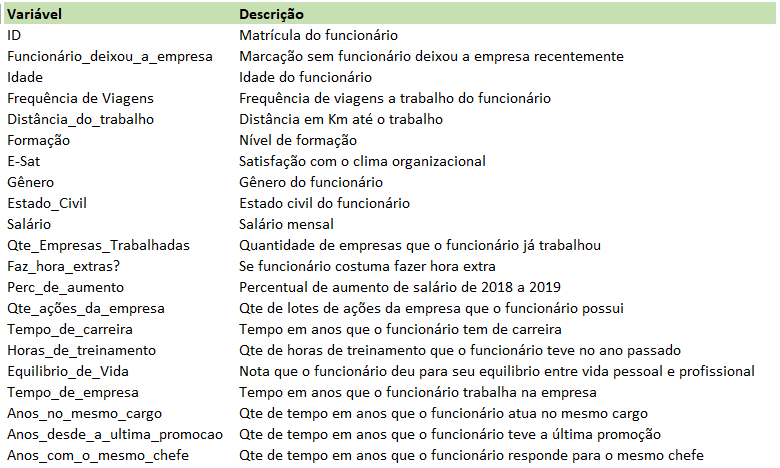
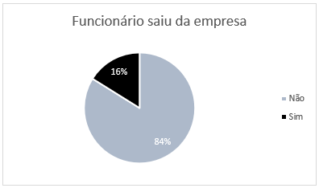
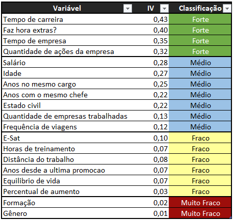
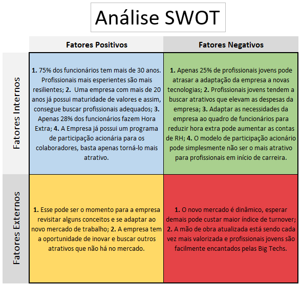

<h1>Análise de Turnover de Funcionários de Uma Empresa</h1>

    <figure>
        
    </figure>

 

O que é o Turnover?

Turnover é o indicador que mede a rotatividade dos trabalhadores nas empresas em um determinado período de tempo (geralmente, a taxa de turnover considera o periodo de 12 meses) seja por quais forem os motivos: demissão voluntária, saída para outras empresas, entre outros.

Como o significado de turnover é rotatividade, estamos falando sobre a substituição de empregados no posto, não incluindo casos em que o cargo é extinto da empresa.

Embora seja até certo ponto normal e esperada na gestão de recursos humanos de qualquer empresa, a rotatividade passa a ser um desafio quando ocorre em altas taxas, porque gera um passivo com demissões e contratações.

É por essa razão que o cálculo de turnover de funcionários deve fazer parte da rotina em qualquer negócio.

Especialistas da área de gestão recomendam que a empresa trabalhe com uma taxa de turnover entre 5% e 10% ao ano

Uma alta taxa de Turnover pode gerar vários impactos indesejados na empresa:

<ul>
    <li>Queda na produtividade: A substituição frequente de funcionários pode resultar em interrupções nos fluxos de trabalho e na perda de conhecimento institucional.</li>
    <li>Impacto na satisfação dos colaboradores: A rotatividade constante pode afetar a satisfação dos colaboradores, podendo levar a uma queda na moral e no engajamento.</li>
    <li>Custos financeiros e de tempo: Quando um funcionário sai da empresa, é preciso arcar com os custos de contratação de um novo colaborador. Isso inclui anúncios de vagas, triagem de currículos, entrevistas, treinamento e integração.</li>
    <li>Impacto na imagem da empresa: Uma alta taxa de turnover pode afetar a reputação da empresa, tornando-a menos atraente para futuros talentos.</li>
</ul>

<h3>Contexto</h3>

Seguindo a metodologia CRISP-MP, o desenvolvimento do projeto seguirá as seguintes etapas:

<ol>
    <li>Entendimento do Negócio</li>
    <li>Entendimento dos Dados</li>
    <li>Preparação dos Dados</li>
    <li>Modelagem e Análise</li>
    <li>Validação</li>
    <li>Plano de Implantação</li>
    <li>Conclusão</li>
    <li>Referências</li>
</ol>

<h3>1. Entendimento do Negócio</h3>
<ol>
    <li>O objetivo da análise é compreender quais fatores estão levando a empresa a apresentar uma taxa de turnover elevada e criar um plano de ação para reduzir o percentual em 6%.</li>
    <li>Assumindo que recebemos uma base de dados sólida, podemos considerar encontrar quais variáveis estão influenciando a saída do colaborador da empresa.</li>
    <li>A rotatividade de fucionários trás um alto custo financeiro para empresa por diversos fatores, como por exemplo: o tempo despendido pelo RH na contratação e treinamento de novos funcionários e a diminuição da capacidade produtiva da equipe pela perda de funcionários com conhecimento avançado sobre o negócio.</li>
    <li>Todo processo de pesquisa, implantação e acompanhamento de novos indicadores gera novos custos. O intuito do projeto é sempre que possível manter essas despesas dentro da folha atual ou que essas sejam mitigadas pela redução da despesa que o atual percentual de turnover está gerando.</li>
    <li>O projeto será considerado bem sucedido se dentro de <strong>6 meses</strong> após sua implantação percentual de turnover for reduzido em <strong>6%.</strong></li>
</ol>

<h3>2. Entendimento dos Dados</h3>
<ol>
    <li>A base de dados utilizada neste projeto foi disponibilizapa no curso de Análise de Dados da Escola Preditiva.ai e contém, além da variável Turnover, mais 19 variáveis que podem ser exploradas e analisadas para encontrar a possível causa do evento.</li>
    <li>O ETL (Extração, Tranformação e Carregamento) é uma peça fundamental no contexto da gestão e análise de dados. Sua importância eleva a simples transformação de dados brutos em informações utilizáveis, ele é a chave sobre o qual repousam a solidez e a precisão das análises empresariais.</li>
</ol>

<h3>3. Preparação dos Dados</h3>

A base de dados fornecida para este projeto já possui todo o tratamento e se encontra pronta para as análises.

    

    
Metadados

    

<h3>4. Análise</h3>

Foram escolhidas e realizadas duas técnicas para a  análises da base: A Análise Exploratória dos Dados <strong>(AED)</strong> e Information Value <strong>(IV)</strong>.

<ol>
    <li><strong>AED - Análise Exploratória dos Dados</strong></li>
     
    

        <figure>
            
            <figcaption> Percentual de turnover.</figcaption>
        </figure>
    

     
    
Realizada com objetivo de compreender melhor o cenário da empresa e gerar insights de possíveis pontos de impactos positivos ou negatívos, além de embasar resultados gerados na análise seguinte.

    
Essa análise permite a extração de informações evitando assim suposições, nos permitindo observar os dados de forma mais objetiva.

    
Requisitos importantes:

    <ul>
        <li>Uma visão clara de como os dados foram coletados (população e amostra)</li>
        <li>A identificação dos tipos de variáveis (qualitativas ou quantitativas)</li>
        <li>Uma coerência da análise com os objetivos do trabalho</li>
        <li>A representação gráfica das variáveis quantitativas e qualitativas</li>
        <li>A análise de medidas de posição, dispersão, gráficos e de possíveis relações entre as variáveis</li>
        <li>A identificação de anomalias e situações atípicas</li>
    </ul>
    <li><strong>Information Value - IV</strong></li>
    
O Information Value é uma técnica estatística usada para quantificar a importância de uma variável na previsão de um resultado. Ele ajuda a entender quais variáveis são mais significativas em um modelo preditivo.

    
É uma medida essencial na seleção de variáveis. Algumas razões são:

    <ul>
        <li>Identificação de variáveis relevantes</li>
        <li>Redução de dimensionalidade</li>
        <li>Melhoria da precisão do modelo</li>
        <li>Interpretação dos resultados</li>
    </ul>
    
O IV é usado em várias áreas, incluindo:

    <ul>
        <li><strong>Recursos Humanos:</strong> Para identificar os fatores que influenciam a retenção de funcionários.</li>
        <li><strong>Marketing:</strong> Para identificar quais fatores influenciam mais as conversões.</li>
        <li><strong>Finanças:</strong> Para avaliar quais variáveis são mais importantes na previsão de riscos de crédito.</li>
        <li><strong>Operações:</strong> Para entender quais fatores afetam a eficiência operacional.</li>
    </ul>
</ol>

Após realizadas a AED e a Análise de IV encontramos as variaveis que apresentam maior influência no índice foco do estudo, o turnover da empresa. E 4 delas foram consideradas com peso forte de influência.

    

 

Também a partir das análises realizadas, foi possível desenvolver uma análise SWOT para comtribuir no plano de implandação das ações necessárias.

    
Análise SWOT

    

<h3>5. Validação</h3>

Definido a ferramenta de implantação, o critério de sucesso e as métricas de acompanhamento, o projeto é apresentado ao cliente com as seguintes etapas:

<ul>
    <li>Objetivo de reduzir em 6% a taxa de Turnover em até 6 meses.</li>
    <li>Atualização dos fatores que estava levando à saida de funcionários.</li>
    <li>Apresentação das análises realizadas (AED e IV).</li>
    <li>Projeto para melhoria imediata.</li>
    <li>Continuidade da melhoria a longo prazo, com as variáveis consideradas com peso médio.</li>
    <li>Framework <strong>5W2H</strong> para aplicação das ações necessárias.</li>
</ul>

<h3>6. Plano de Implantação</h3>

Acesse <a href="relatorio.md">aqui</a> a relatório final com o <strong>Plano de Implementação</strong> e o dashboard com as métricas do estudo.

<h3>7. Conclusão</h3> 

Essa análise tinha como objetivo desvendar os fatores que estavam elevando o índice de turnover da empresa e, consequentimente, diversos outros custos, seja eles financeiros ou não. 

Concluiu-se que são 4 os fatores principais que necessitam de atenção imediata para recuperar a saúde do negócio: Tempo de carreira e Tempo de empresa(para profissionais com até 2 anos), Profissionais que fazem hora extra e o plano de participação acionária (quantidade de ações da empresa).

Foi sugerido e elaborado um plano de ação para responder às necessidades apresentadas.

<h3>8. Referências</h3>
<ul>
<li><a href="https://www.preditiva.ai/blog/como-realizar-a-extracao-e-preparacao-de-dados-em-projetos">Preditiva.ai - Como realizar a extração e preparação de dados em projetos?</a></li>
<li><a href="https://fia.com.br/blog/turnover/">FIA Business School - Turnover: o que é, como calcular a fórmula e impactos na empresa</a></li>
<li><a href="https://www.gupy.io/blog/turnover">Gupy - Turnover: o que é, como calcular e qual o impacto na empresa</a></li>
<li><a href="https://www.ibilce.unesp.br/Home/Departamentos/CiencCompEstatistica/Adriana/analise-exploratoria-de-dados.pdf">Unesp - Análise exploratória de dados</a></li>
<li><a href="https://www.thebilab.com.br/post/information-value-analise-de-dados">The BI Lab - Information Value (IV): O que é, Como Calcular e sua Importância para a Análise de Dados</a></li>
<li><a href="https://blog.reachr.com.br/recrutamento-e-selecao-quanto-custa-para-empresa/">Rearch - Recrutamento e seleção: quanto custa para a empresa?</a></li>
</ul>

