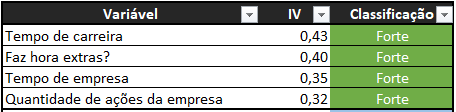
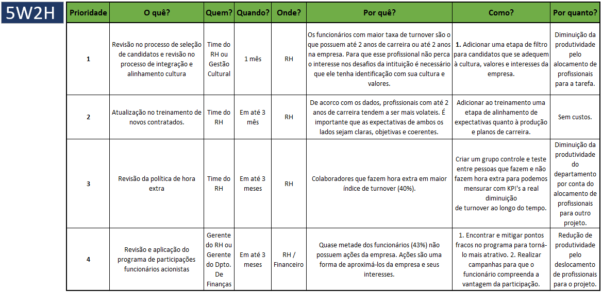

  <h1>Relatório</h1>  
  
Com base nos dados fornecidos de um período de 12 meses, a empresa analisada possui um turnover de 16%, 6% acima da média considerada saudável por especialistas (5% a 10%).
 
  
Esse índice foi calculado a partir do total de 1.470 funcionários, dos quais 237 deixaram a empresa. Para entender melhor as causas dessa alta rotatividade, foi realizada uma investigação com base em 19 fatores que poderiam influenciar na decisão dos funcionários de sair da empresa: Uma <strong>Análise Exploratória</strong> para melhor compreensão de cada variável isoladamente e uma <strong>Análide de IV</strong> para separar e focar nas variáveis de maior peso de influência.</strong> 
  
  
Ao final da Análise Exploratória obtivemos lista de <a href="insights.md">Insights</a> gerada através de constatações e algumas questões levantadas. Esses insights podem contribuir para um plano de ação ao final da análise.

  
  
Em seguida foi realização da Análide de IV, o que tornou possível encontrar e classificar os fatores de maior peso na ocorrência de turnovers, conforme a tabela a seguir:

  

    
  

   
  
Os Fatores com classificação fraco e muito fraco não são itens de preocupação e podem ser descartados quanto a seu peso na influência do turnover, já os que foram classificados como fortes e médios requerem atenção dos gestores/responsáveis.

  
Com o intuito de entregar valor no curto prazo, esses podem ser separados em blocos para que ações de acordo com a devida urgência sejam tomadas a seu devido tempo.

  
  <h1>Plano de Implantação</h1>
  
Após a realização das análises constatou-se que 4 variáveis foram classificadas com "fortes" no que tange a influênciar o funcionário deixar a empresa, e o plano de ação mais imediato irá focar nesses itens. São eles: <strong>Tempo de carreira</strong>, <strong>Faz hora extras?</strong>, <strong>Quantidade de ações da empresa</strong> e <strong>Tempo na empresa</strong>.

  

    <figure>
      
      <figcaption> 
<small>As 4 variáveis de maior influência no <i>turnover</i></small>
</figcaption>
    </figure>
  

  
Para facilitar a implatação das mudanças necessárias e o acompanhamento de sua aplicação, sugerimos o framework <a href="5W2H.md">5W2H</a>, onde as ações de melhorias necessárias, os respectivos responsáveis e possíveis custos ficam dispostos de maneira clara e objetiva.

  
5W2H Para Redução de Turnover

  

    
  

  

    
<a href="Estudo_de_Caso_Turnover.md">retornar</a>

  

